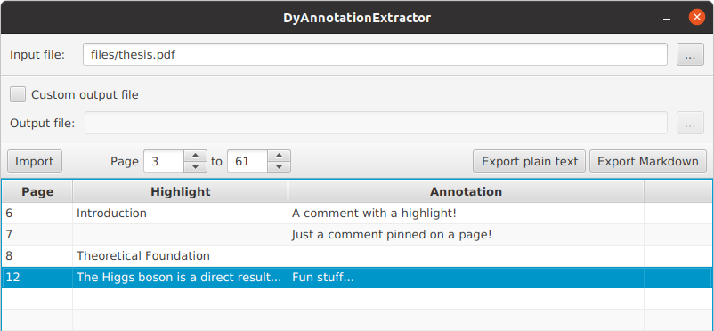

# DAE_GUI
A GUI extension of [DyAnnotationExtractor](https://github.com/juupje/DyAnnotationExtractor), a project started by dimi2 (see [https://github.com/dimi2/](https://github.com/juupje/DyAnnotationExtractor)).

It features an intuitive single-page GUI to extract annotations and highlights from PDF documents and export them to a new file in either markdown or plain-text format.

